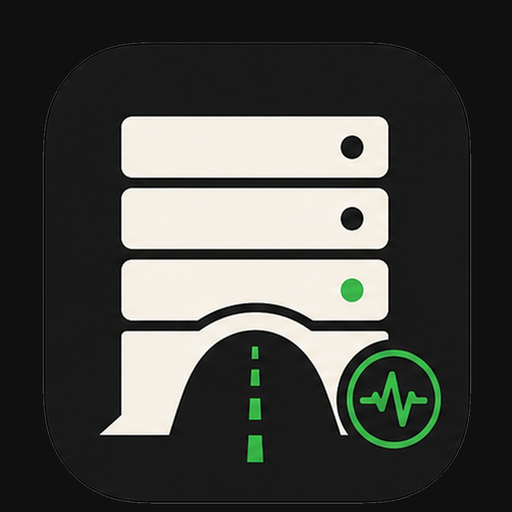
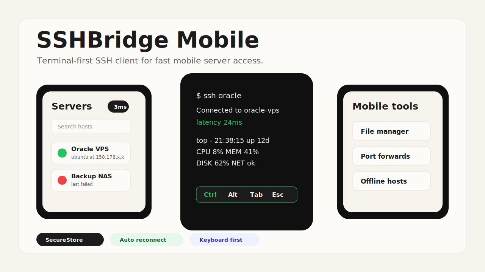

<p align="center">
  
</p>

# SSHBridge Mobile


SSHBridge Mobile is a terminal-first SSH client for phones and tablets. It is
designed around one goal: open the app, pick a server, and get back to the
terminal with as little friction as possible.



## What It Does

- **Fast server access**: save servers once, then reconnect from the server list.
- **Mobile SSH terminal**: fullscreen terminal, custom key bar, paste support,
  arrow keys, `Ctrl`, `Alt`, `Esc`, `Tab`, and terminal-friendly symbols.
- **Offline mode**: use saved offline hosts without signing in to a server.
- **Secure local storage**: JWTs and offline SSH secrets are stored with
  `expo-secure-store`; legacy AsyncStorage secrets are migrated automatically.
- **Host key verification**: review and accept new or changed SSH host keys.
- **File manager**: browse, create, rename, edit, copy, move, and delete files
  over SSH.
- **Server stats**: check CPU, memory, disk, and quick actions from mobile.
- **Port forwarding**: manage local and remote SSH tunnels from the app.
- **Session resilience**: reconnect and keep terminal sessions alive across
  backgrounding and poor mobile networks where supported.

## Recommended Flow

1. Install the APK from the latest GitHub release.
2. Open SSHBridge Mobile.
3. Enter your SSHBridge server URL, or choose **Continue offline**.
4. Add or sync servers.
5. Tap a server to enter the terminal.

For daily use, the home screen should be the server list. Avoid re-entering
passwords or keys unless credentials have changed.

## Installation

### Android

Download the latest APK from
[GitHub Releases](https://github.com/nghoang1288/SSHBridge-Mobile/releases).

Current release line: `0.2`.

### iOS

iOS support is kept in the Expo/React Native project, but no public App Store or
TestFlight release is published from this repository yet. Build with EAS or a
local iOS development environment if needed.

## Build From Source

Prerequisites:

- Node.js 20 or newer
- npm
- Android Studio / Android SDK for APK builds
- Java version compatible with the Android Gradle Plugin used by the project

Install dependencies:

```sh
npm install
```

Start the Expo development server:

```sh
npm run start
```

Build a release APK locally:

```sh
cd android
./gradlew assembleRelease
```

On Windows PowerShell:

```powershell
cd android
.\gradlew.bat assembleRelease
```

The APK is generated at:

```text
android/app/build/outputs/apk/release/app-release.apk
```

## Configuration Notes

- Prefer `https://` for the SSHBridge server URL.
- `http://` is allowed for local or trusted self-hosted networks, but it is
  plaintext and should not be used over the public internet.
- Android backup is disabled for app data.
- Private keys and passwords should never be committed to the repository.

## Development Commands

```sh
npm run start
npm run android
npm run ios
npx tsc --noEmit
npm audit --omit=dev
```

## Repository Structure

```text
app/                  Expo Router screens, mobile UI, API, and storage logic
app/tabs/sessions/    Terminal, file manager, tunnel, and stats screens
assets/images/        App icon and splash assets
plugins/              Expo config plugins for native Android/iOS settings
android/              Generated/native Android project used for APK builds
repo-images/          README and repository presentation assets
```

## Security

Report vulnerabilities through
[GitHub Security Advisories](https://github.com/nghoang1288/SSHBridge-Mobile/security/advisories).
See [SECURITY.md](./SECURITY.md) for the reporting policy.

## Contributing

Pull requests are welcome. Before opening a PR, read
[CONTRIBUTING.md](./CONTRIBUTING.md), run TypeScript checks, and include mobile
screenshots for UI changes.

## License

Distributed under the Apache License 2.0. See [LICENSE](./LICENSE).
